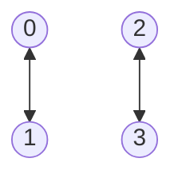

# qpu175

## Native Gates
**Single Qubit**: MZ, RX, RX12

**Two Qubit**: CR

## Topology
**Number of qubits**: 4

**Qubits**: 0, 1, 2, 3

## Qubit fidelity and coherence times

| Qubit | Assignment Fidelity | T1 (µs) | T2 (µs) | Gate infidelity (e-3) |
| --- | --- | --- | --- | --- |
| 0 | 0.0 | 0.0 ± 0.0 | 0.0 ± 0.0 | 0.0 |
| 1 | 0.0 | 0.0 ± 0.0 | 0.0 ± 0.0 | 0.0 |
| 2 | 0.0 | 0.0 ± 0.0 | 0.0 ± 0.0 | 0.0 |
| 3 | 0.0 | 0.0 ± 0.0 | 0.0 ± 0.0 | 0.0 |
