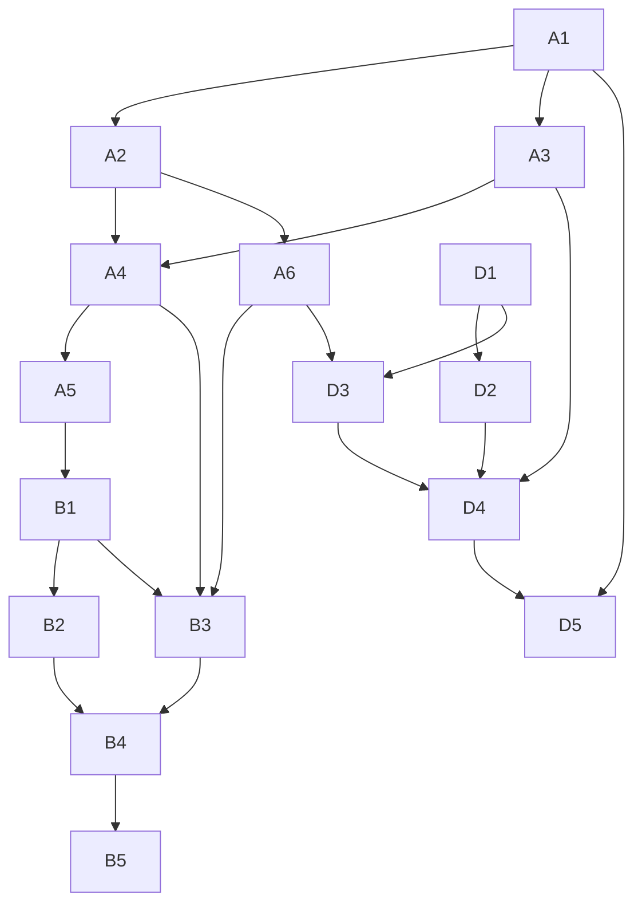

# qw11q

## Native Gates
### Single Qubit
RX  RX12  MZ
### Two Qubit
CZ  iSWAP
## Topology

```mermaid
graph TD;
    A1-->A2;
    A1-->A3;
    A1-->D5;
    A2-->A4;
    A2-->A6;
    A3-->A4;
    A3-->D4;
    A4-->A5;
    A4-->B3;
    A5-->B1;
    A6-->B3;
    A6-->D3;
    B1-->B2;
    B1-->B3;
    B2-->B4;
    B3-->B4;
    B4-->B5;
    D1-->D2;
    D1-->D3;
    D2-->D4;
    D3-->D4;
    D4-->D5;
```
