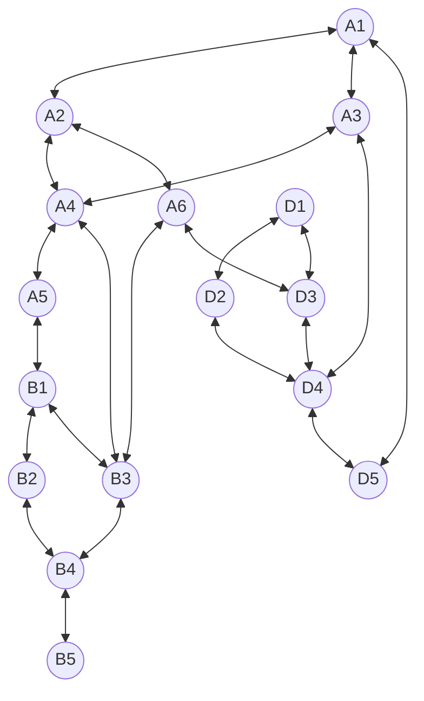

# qw11q

## Native Gates
**Single Qubit**: RX, RX12, MZ

**Two Qubit**: CZ, iSWAP

## Topology
**Number of qubits**: 16

**Qubits**: A1 (0), A2 (1), A3 (2), A4 (3), A5 (4), A6 (5), B1 (6), B2 (7), B3 (8), B4 (9), B5 (10), D1 (11), D2 (12), D3 (13), D4 (14), D5 (15)

## Table for B line

Qubit Value | Qubit  | Readout Fidelity | Assignment Fidelity | T1 (µs) | T2 (µs) | Gate infidelity (e-3) |
| ------------- | ------------- | --------- | -------------------- | ------- | ------- | -------------------- |
|6| B1 | 0.93 | 0.96 | 24.3 ± 0.2 | 27.5 ± 0.5 | 7.3 ± 0.1 |
|7| B2 | 0.93 | 0.96 | 19.6 ± 0.1 | 28.6 ± 0.4 | 1.53 ± 0.03 |
|8| B3 | 0.92 | 0.96 | 24.6 ± 0.2 | 28.4 ± 0.5 | 1.19 ± 0.03 |
|9| B4 | 0.88 | 0.94 | 14.3 ± 0.1 | 18.2 ± 0.3 | 8.5 ± 0.1 |
|10| B5 | 0.90 | 0.95 | 33.4 ± 0.2 | 23.0 ± 1.0 | 1 ± 0.03 |

## Report Links:

**1-B1**: http://login.qrccluster.com:9000/xu9BfKH9T2eT8kpp1L5YaQ==/  
**2-B2**: http://login.qrccluster.com:9000/C8U5KwTiSSKjAFii09CElA==/  
**3-B3**: http://login.qrccluster.com:9000/4mpgIlKVTEOEh9zGpQLlFQ==/  
**4-B4**: http://login.qrccluster.com:9000/jZgN3ku1QGSsmARztVXgnw==/  
**4-B5**: http://login.qrccluster.com:9000/ytGFcieeT4imfHlD47ZY9g==/  
