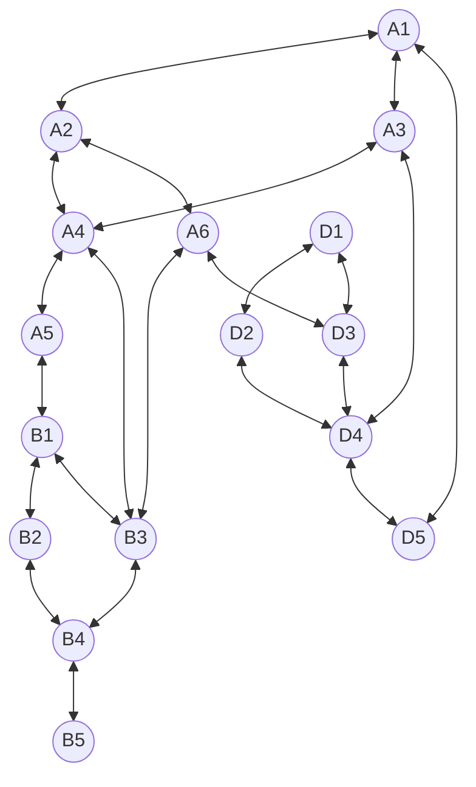

# qw11q

## Native Gates
**Single Qubit**: RX, RX12, MZ

**Two Qubit**: CZ, iSWAP

## Topology
**Number of qubits**: 16

**Qubits**: A1 (0), A2 (1), A3 (2), A4 (3), A5 (4), A6 (5), B1 (6), B2 (7), B3 (8), B4 (9), B5 (10), D1 (11), D2 (12), D3 (13), D4 (14), D5 (15)

