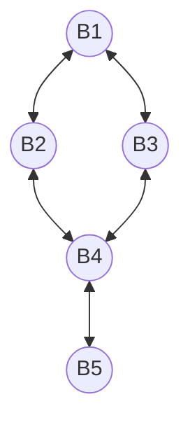

# qw21q-b

## Native Gates
**Single Qubit**: MZ, RX, RX12

**Two Qubit**: CZ

## Topology
**Number of qubits**: 5

**Qubits**: B1 (0), B2 (1), B3 (2), B4 (3), B5 (4)

## Qubit fidelity and coherence times

| Qubit | Assignment Fidelity | T1 (µs) | T2 (µs) | Gate infidelity (e-3) |
| --- | --- | --- | --- | --- |
| B1 | 0.92 | 9.7 ± 0.5 | 1.1 ± 0.1 | 0.0 |
| B2 | 0.95 | 21.4 ± 0.9 | 1.0 ± 0.1 | 0.0 |
| B3 | 0.88 | 18.9 ± 1.1 | 1.4 ± 0.2 | 0.0 |
| B4 | 0.83 | 4.1 ± 0.1 | 1.6 ± 0.1 | 0.0 |
| B5 | 0.96 | 21.1 ± 1.5 | 26.4 ± 2.8 | 0.0 |

