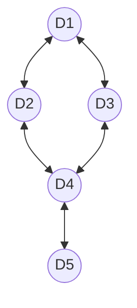

# qw21q-d

## Native Gates
**Single Qubit**: RX, MZ

**Two Qubit**:

## Topology
**Number of qubits**: 5

**Qubits**: D1 (0), D2 (1), D3 (2), D4 (3), D5 (4)

## Qubit fidelity and coherence times

| Qubit | Assignment Fidelity | T1 (µs) | T2 (µs) | Gate infidelity (e-3) |
| --- | --- | --- | --- | --- |
| D1 | 0.95 | 0.0 | 31.0 ± 2.9 | 0.0 |
| D2 | 0.95 | 0.0 | 7.0 ± 0.7 | 0.0 |
| D3 | 0.95 | 0.0 | 13.7 ± 1.1 | 0.0 |
| D4 | 0.93 | 21.9 | 24.0 | 0.0 |
| D5 | 0.84 | 0.0 | 2.1 ± 1.0 | 0.0 |
