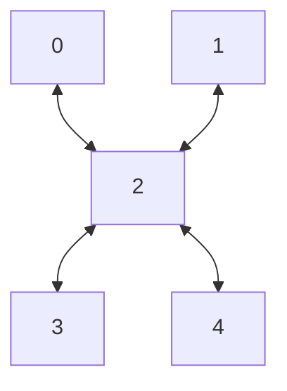

# qw5q_platinum

## Native Gates
**Single Qubit**: RX, RX12, MZ

**Two Qubit**: CZ

## Topology
**Number of qubits**: 5

**Qubits**: [0, 1, 2, 3, 4]

```mermaid
graph TD;
    0 <--> 2;
    1 <--> 2;
    2 <--> 3;
    2 <--> 4;
```
