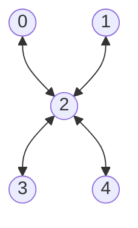

# qw5q_platinum

## Native Gates
**Single Qubit**: MZ, RX, RX12

**Two Qubit**: iSWAP, CZ

## Topology
**Number of qubits**: 5

**Qubits**: 0, 1, 2, 3, 4

## Qubit fidelity and coherence times

| Qubit | Assignment Fidelity | T1 (µs) | T2 (µs) | Gate infidelity (e-3) |
| --- | --- | --- | --- | --- |
| 0 | 0.96 | 47.3 ± 2.5 | 11.1 ± 0.4 | 0.0 |
| 1 | 0.97 | 37.1 ± 1.2 | 23.2 ± 0.7 | 0.0 |
| 2 | 0.98 | 31.9 ± 0.9 | 9.0 ± 0.2 | 0.0 |
| 3 | 0.95 | 30.8 ± 0.8 | 26.1 ± 1.1 | 0.0 |
| 4 | 0.99 | 33.7 ± 0.9 | 3.4 ± 0.1 | 0.0 |

