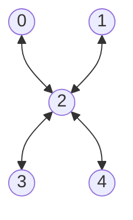

# qw5q_platinum

## Native Gates
**Single Qubit**: MZ, RX

**Two Qubit**: CZ

## Topology
**Number of qubits**: 5

**Qubits**: 0, 1, 2, 3, 4

```mermaid
---
config:
layout: elk
---
graph TD;
    0((0)) <--> 2((2));
    1((1)) <--> 2((2));
    2((2)) <--> 3((3));
    2((2)) <--> 4((4));
```

## Qubit fidelity and coherence times

| Qubit | Assignment Fidelity | T1 (µs) | T2 (µs) | Gate infidelity (e-3) |
| --- | --- | --- | --- | --- |
| 0 | 0.89 | 51.0 ± 2.3 | 11.1 ± 0.4 | 2.5 ± 0.78 |
| 1 | 0.90 | 38.3 ± 1.4 | 23.2 ± 0.7 | 0.36 ± 0.73 |
| 2 | 0.88 | 36.0 ± 1.1 | 9.0 ± 0.2 | 3.3 ± 0.92 |
| 3 | 0.85 | 37.2 ± 1.1 | 26.1 ± 1.1 | 25 ± 6.1 |
| 4 | 0.96 | 37.2 ± 1.2 | 3.4 ± 0.1 | N/A |
