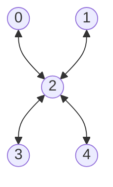

# qw5q_platinum

This branch contains an uncalibrated platform. Hardware wiring and topology are
preserved, but parameters are startup placeholders and all calibration results
are unknown. Calibrate the platform before running experiments; zero-valued
frequencies, powers, amplitudes, and durations are not operating settings.

## Native Gates
**Single Qubit**: MZ, RX

**Two Qubit**: CZ

## Topology
**Number of qubits**: 5

**Qubits**: 0, 1, 2, 3, 4

```mermaid
---
config:
layout: elk
---
graph TD;
    0((0)) <--> 2((2));
    1((1)) <--> 2((2));
    2((2)) <--> 3((3));
    2((2)) <--> 4((4));
```

## Qubit fidelity and coherence times

| Qubit | Assignment Fidelity | T1 (µs) | T2 (µs) | Gate infidelity (e-3) |
| --- | --- | --- | --- | --- |
| 0 | N/A | N/A | N/A | N/A |
| 1 | N/A | N/A | N/A | N/A |
| 2 | N/A | N/A | N/A | N/A |
| 3 | N/A | N/A | N/A | N/A |
| 4 | N/A | N/A | N/A | N/A |
