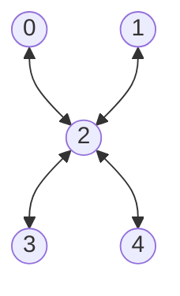

# tuna5

## Native Gates
**Single Qubit**: MZ, RX, RX12

**Two Qubit**: CZ, iSWAP

## Topology
**Number of qubits**: 5

**Qubits**: 0, 1, 2, 3, 4

## Qubit fidelity and coherence times

| Qubit | Assignment Fidelity | T1 (µs) | T2 (µs) | Gate infidelity (e-3) |
| --- | --- | --- | --- | --- |
| 0 | 0.95 | 37.4 ± 1.1 | 14.0 ± 0.4 | N/A |
| 1 | 0.96 | 33.3 ± 0.8 | 22.0 ± 1.0 | N/A |
| 2 | 0.92 | 24.3 ± 0.6 | 29.4 ± 0.5 | N/A |
| 3 | 0.88 | 18.9 ± 0.5 | 18.6 ± 1.4 | N/A |
| 4 | 0.81 | 36.0 ± 2.0 | 87.8 ± 17.8 | N/A |
