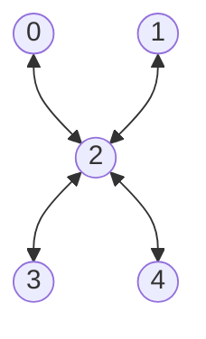

# tuna5

## Native Gates
**Single Qubit**: MZ, RX, RX12

**Two Qubit**: 

## Topology
**Number of qubits**: 5

**Qubits**: 0, 1, 2, 3, 4

## Qubit fidelity and coherence times

| Qubit | Assignment Fidelity | T1 (µs) | T2 (µs) | Gate infidelity (e-3) |
| --- | --- | --- | --- | --- |
| 0 | 0.90 | 26.6 ± 0.6 | 8.0 ± 0.1 | N/A |
| 1 | 0.98 | 18.4 | 11.5 | N/A |
| 2 | 0.77 | 8.5 | 3.6 | N/A |
| 3 | 0.87 | 24.0 | 3.3 | N/A |
| 4 | 0.84 | 7.0 | 9.6 | N/A |

